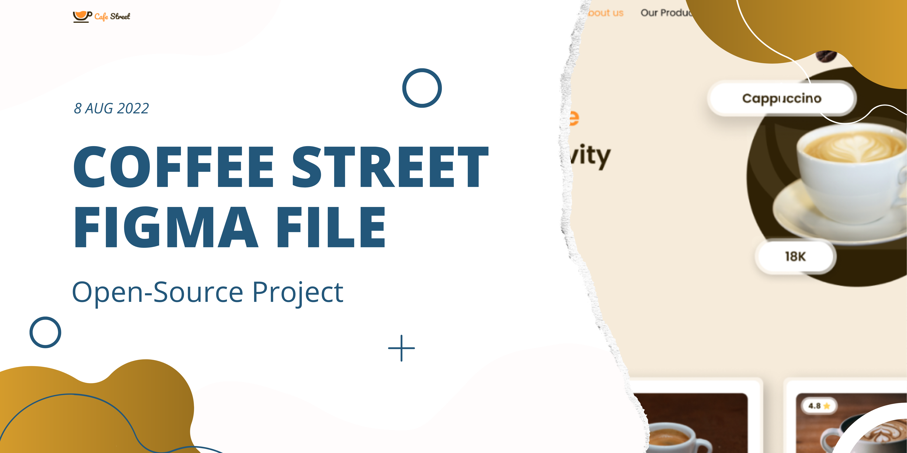

# Open-Source 💻

## Figma file
I'll send you a copy of The figma file, So that you can work with that. Click [here](https://www.figma.com/community/file/1138256358581554095)  
Then make an Issue and tell me which part you want to Code.

> **Note**  
> If you don't have Figma, You can download it from [here](https://www.figma.com/downloads/)

## Roles
- Just use `HTML`, `CSS`, `JavaScript`
- Make it `Responsive`
- Before making any PR (Pull Request), You must make an `Issue` and it has to be assigned to you.
- If you make a PR, I'll ask you about your `Issue NO`, You must tell me, If not then It will not be accepted.
- You must write in order, I've made that for you.
- Don't bring any changes to the `global.css` File, Just use from it.

### When your PR is accepted, you can make another PR for putting your name here.
|Name|Reponsibility|duration|
|-----|-----|-----|
|forExemple|Navbar|30 Minutes|
